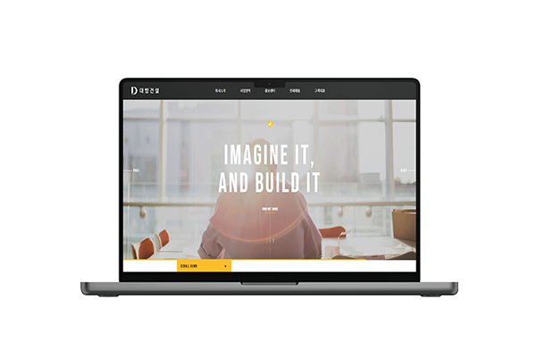

# 📌 Daebang 클론코딩
### 대방건설

## 💻 Clone Coding 
**1991년에 설립된 대한민국의 건설업체, 대방건설의 클론코딩 웹사이트 입니다.** 지디웹 선정작이며 메인 비주얼 영역의 애니메이션과 깔끔한 레이아웃이 특징인 사이트입니다. 
slick.js와 scroll.js, splittin.js 라이브러리를 사용했습니다.

 

### 👀 클론코딩 사이트 보기 (Click to View) 
👉 <https://breeghty.github.io/Daebang_clonecoding/>

 

### ✔ 작업일자(Date)
2022.11.

 

### ✔ 키워드(Keyword)
- 클론코딩 100%
- 웹표준, 웹접근성
- HTML, CSS, Javascript, jQuery
- Slick.js, Scrolla.js, Splittin.js, 다양한 CSS 애니메이션 구현, 스크롤 고정 헤더

 

### ✔ 풀페이지(Full page)

